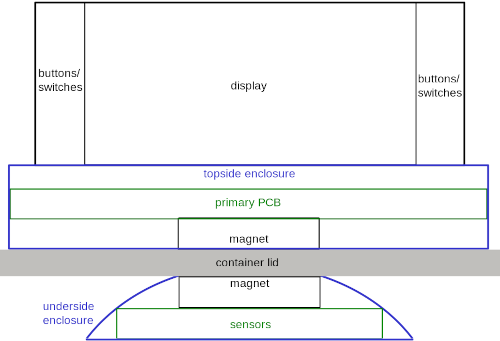
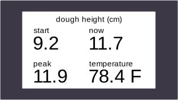

# Jake's lab notebook

* [2024-01-23 - Preliminary parts research](#2024-01-23---preliminary-parts-research)
* [2024-02-06 - Side view of design](#2024-02-06---side-view-of-design)
* [2024-02-06 - 1st TA meeting](#2024-02-06---1st-ta-meeting)
* [2024-02-10 - Display research/design](#2024-02-10---display-researchdesign)

2024-01-23 - Preliminary parts research
=======================================
I started looking into parts and identified some possibilities. Will need to do more research into the pros and cons of the different sensor types. 

Possible temperature sensor: [Texas Instruments LM61BIZ/LFT3](https://www.digikey.com/en/products/detail/texas-instruments/LM61BIZ%252FLFT3/12324753)

Proximity sensors could be ultrasonic, infrared LED, or VCSEL.  
Ultrasonic: [Adafruit ULTRASONIC SENSOR SONAR DISTANCE 3942](https://www.digikey.com/en/products/detail/adafruit-industries-llc/3942/9658069)  
IR LED: [Vishay VCNL3020-GS18](https://www.mouser.com/ProductDetail/Vishay-Semiconductors/VCNL3020-GS18?qs=5csRq1wdUj612SFHAvx1XQ%3D%3D)  
VCSEL: [Vishay VCNL36826S](https://www.mouser.com/ProductDetail/Vishay-Semiconductors/VCNL36826S?qs=d0WKAl%252BL4KbhexPI0ncp8A%3D%3D)  

MCU: [STM32F303K8T6TR](https://www.mouser.com/ProductDetail/STMicroelectronics/STM32F303K8T6TR?qs=sPbYRqrBIVk%252Bs3Q4t9a02w%3D%3D)

switch: [E-Switch RA1113112R](https://www.digikey.com/en/products/detail/e-switch/RA1113112R/3778055)  
button: [CUI Devices TS02-66-50-BK-160-LCR-D](https://www.digikey.com/en/products/detail/cui-devices/TS02-66-50-BK-160-LCR-D/15634352)

Alec found:  
display: [4x16 Character LCD](https://newhavendisplay.com/4x16-character-lcd-stn-blue-display-with-white-side-backlight/)  
battery: [Adafruit Li-ion battery - 3.7V 2000mAh](https://www.microcenter.com/product/503621/Lithium_Ion_Battery_-_37v_2000mAh)

2024-02-06 - Side view of design
================================
Drew this initial draft of a visual for the design. It's not to scale. In particular the display will probably be bigger compared to the other parts. The primary PCB may also be bigger compared to the sensor part.  

2024-02-06 - 1st TA meeting
===========================
We met with our TA, Tianxiang Zheng. He made the following suggestions about our proposal:

* Leave out our stretch goal of including wireless communication and an app. We can always add it later if we decide we can.
* In high-level requirements, combine sensor requirements into one, and add a display requirement.
* Change the distance requirement to one based off a percentage.
* As a reference for the "Tolerance Analysis" part, he recommended reading the course wiki [page on linear regulators](https://courses.engr.illinois.edu/ece445/wiki/#/regulators/index). 
* To see a project with some similarities to ours, he recommended looking at [Door Knocking Alarm for the Hearing Impaired](https://courses.engr.illinois.edu/ece445/getfile.asp?id=22603) from Fall '23.

2024-02-10 - Display research/design
====================================
We're planning on showing the following simultaneously on the display:

* minimum/starting dough height
* current dough height
* current temperature

It could look like this:  

Pros, cons and examples of the most likely display types:

#### **LCD**
##### example

* $7.85, 5.2x2.7cm [Focus LCDs G12864F-FTW-DW63](https://www.digikey.com/en/products/detail/focus-lcds/G12864F-FTW-DW63/22158594)

##### pros

* cheapest
* fairly low power consumption
* can usually use SPI and/or I2C
* text-only models could be easier to program

##### cons

* worst readability and aesthetics
* usually 5V but can be found with 3V

#### **OLED**
##### exmaple

* $13.98, 5.3x1.5cm [Winstar Display WEO025664AWAP3N00000](https://www.digikey.com/en/products/detail/winstar-display/WEO025664AWAP3N00000/20533275)

##### pros

* better readability and aesthetics
* can usuall use SPI and/or I2C

##### cons

* higher power consumption
* expensive

#### **E-ink**
##### example

* $7.18, 6.0x3.0cm [Pervasive Displays E2266JS0C1](https://www.digikey.com/en/products/detail/pervasive-displays/E2266JS0C1/13572401)

##### pros

* best readability and aesthetics
* lowest power consumption
* thin and light weight

##### cons

* supposedly more expensive, but see above example
* not many with I2c, but can be found
* might be harder to program?

