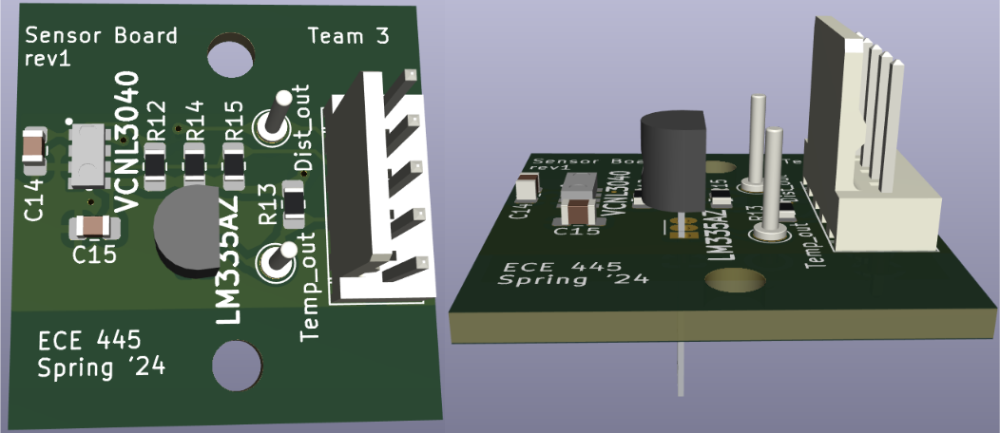

# Jake's lab notebook

* [Week 2 - 2024-01-21](#week-2---2024-01-21)
	* [Preliminary parts research](#preliminary-parts-research)
* [Week 3 - 2024-01-28](#week-3---2024-01-28)
	* [Front view of design](#front-view-of-design)
	* [1st TA meeting](#1st-ta-meeting)
* [Week 4 - 2024-02-04](#week-4---2024-02-04)
	* [Display research/design](#display-researchdesign)
* [Week 5 - 2024-02-11](#week-5---2024-02-11)
	* [Display choices](#display-choices)
	* [Further parts research](#further-parts-research)
* [Week 6 - 2024-02-18](#week-6---2024-02-18)
	* [Design Document work](#design-document-work)
	* [Switches, buttons, LEDs](#switches-buttons-leds)
	* [Parts change](#parts-change)
* [Week 7 - 2024-02-25](#week-7---2024-02-25)
	* [Design Review](#design-review)
	* [Initial schematics](#initial-schematics)
* [Week 8 - 2024-03-03](#week-8---2024-03-03)
	* [First PCB order](#first-pcb-order)
	* [MCU pin assignments](#mcu-pin-assignments)
* [Week 9 - 2024-03-10](#week-9---2024-03-10)
	* [Parts update and order](#parts-update-and-order)
* [Week 10 - 2024-03-17](#week-10---2024-03-17)
	* [More parts changes](#more-parts-changes)
	* [Main board layout progress](#main-board-layout-progress)
* [Week 11 - 2024-03-24](#week-11---2024-03-24)
	* [Sensor Board rev1 complete](#sensor-board-rev1-complete)
	* [Work started on Sensor Board rev2](#work-started-on-sensor-board-rev2)
	* [Sensor Board rev1 debugging](#sensor-board-rev1-debugging)
	* [Main Board rev1 PCB order placed](#main-board-rev1-pcb-order-placed)
	* [Backup parts order](#backup-parts-order)
* [Week 12 - 2024-03-31](#week-12---2024-03-31)
	* [Enclosure research / design](#enclosure-research--design)
	* [Distance sensor progress](#distance-sensor-progress)
	* [Sensor Board rev2 ordered](#sensor-board-rev2-ordered)
	* [Main Board rev2: change of plans](#main-board-rev2-change-of-plans)
* [Week 13 - 2024-04-07](#week-13---2024-04-07)
	* [Introducing DigiDough!](#introducing-digidough)
	* [Main Board rev2 ordered](#main-board-rev2-ordered)
	* [Main Board rev1 complete](#main-board-rev1-complete)
* [Week 14 - 2024-04-14](#week-14---2024-04-14)
	* [Sensor Board rev2 complete](#sensor-board-rev2-complete)
	* [Enclosure design](#enclosure-design)
	* [Main Board progress](#main-board-progress)
	* [Fixing connector mismatch](#fixing-connector-mismatch)
	* [More regulator trouble](#more-regulator-trouble)
* [Week 15 - 2024-04-21](#week-15---2024-04-21)
	* [Regulator works!](#regulator-works)
	* [Cable options](#cable-options)
	* [Troubleshooting display pins](#troubleshooting-display-pins)
	* [Finishing enclosure, recording videos](#finishing-enclosure-recording-videos)
	* [Final demo](#final-demo)

Week 2 - 2024-01-21
===================
Preliminary parts research
--------------------------
I started looking into parts and identified some possibilities. Will need to do more research into the pros and cons of the different sensor types. 

Possible temperature sensor: [Texas Instruments LM61BIZ/LFT3](https://www.digikey.com/en/products/detail/texas-instruments/LM61BIZ%252FLFT3/12324753)

Proximity sensors could be ultrasonic, infrared LED, or VCSEL.  
Ultrasonic: [Adafruit ULTRASONIC SENSOR SONAR DISTANCE 3942](https://www.digikey.com/en/products/detail/adafruit-industries-llc/3942/9658069)  
IR LED: [Vishay VCNL3020-GS18](https://www.mouser.com/ProductDetail/Vishay-Semiconductors/VCNL3020-GS18?qs=5csRq1wdUj612SFHAvx1XQ%3D%3D)  
VCSEL: [Vishay VCNL36826S](https://www.mouser.com/ProductDetail/Vishay-Semiconductors/VCNL36826S?qs=d0WKAl%252BL4KbhexPI0ncp8A%3D%3D)  

MCU: [STM32F303K8T6TR](https://www.mouser.com/ProductDetail/STMicroelectronics/STM32F303K8T6TR?qs=sPbYRqrBIVk%252Bs3Q4t9a02w%3D%3D)

switch: [E-Switch RA1113112R](https://www.digikey.com/en/products/detail/e-switch/RA1113112R/3778055)  
button: [CUI Devices TS02-66-50-BK-160-LCR-D](https://www.digikey.com/en/products/detail/cui-devices/TS02-66-50-BK-160-LCR-D/15634352)

Alec found:  
display: [4x16 Character LCD](https://newhavendisplay.com/4x16-character-lcd-stn-blue-display-with-white-side-backlight/)  
battery: [Adafruit Li-ion battery - 3.7V 2000mAh](https://www.microcenter.com/product/503621/Lithium_Ion_Battery_-_37v_2000mAh)

Week 3 - 2024-01-28
===================
Front view of design
--------------------
Drew this initial draft of a visual for the design. It's not to scale. In particular the display will probably be bigger compared to the other parts. The primary PCB may also be bigger compared to the sensor part.  

1st TA meeting
--------------
We met with our TA, Tianxiang Zheng. He made the following suggestions about our proposal:

* Leave out our stretch goal of including wireless communication and an app. We can always add it later if we decide we can.
* In high-level requirements, combine sensor requirements into one, and add a display requirement.
* Change the distance requirement to one based off a percentage.
* As a reference for the "Tolerance Analysis" part, he recommended reading the course wiki [page on linear regulators](https://courses.engr.illinois.edu/ece445/wiki/#/regulators/index). 
* To see a project with some similarities to ours, he recommended looking at [Door Knocking Alarm for the Hearing Impaired](https://courses.engr.illinois.edu/ece445/getfile.asp?id=22603) from Fall '23.

Week 4 - 2024-02-04
===================
Display research/design
-----------------------
We're planning on showing the following simultaneously on the display:

* minimum/starting dough height
* current dough height
* current temperature

It could look like this:  

Pros, cons and examples of the most likely display types:

#### **LCD**

##### example

* $7.85, 5.2x2.7cm [Focus LCDs G12864F-FTW-DW63](https://www.digikey.com/en/products/detail/focus-lcds/G12864F-FTW-DW63/22158594)

##### pros

* cheapest
* fairly low power consumption
* can usually use SPI and/or I2C
* text-only models could be easier to program

##### cons

* worst readability and aesthetics
* usually 5V but can be found with 3V

#### **OLED**

##### exmaple

* $13.98, 5.3x1.5cm [Winstar Display WEO025664AWAP3N00000](https://www.digikey.com/en/products/detail/winstar-display/WEO025664AWAP3N00000/20533275)

##### pros

* better readability and aesthetics
* can usuall use SPI and/or I2C

##### cons

* higher power consumption
* expensive

#### **E-ink**

##### example

* $7.18, 6.0x3.0cm [Pervasive Displays E2266JS0C1](https://www.digikey.com/en/products/detail/pervasive-displays/E2266JS0C1/13572401)

##### pros

* best readability and aesthetics
* lowest power consumption
* thin and light weight

##### cons

* supposedly more expensive, but see above example
* not many with I2c, but can be found
* might be harder to program?

Week 5 - 2024-02-11
===================
Display choices
---------------
Alec and I discussed the display options and whether we should try to find one that uses I2C or if SPI would be okay. At the moment we're leaning toward using an E-Ink display, and we don't think SPI would be a problem.

Further parts research
----------------------
These are some parts that could work for our device:

* temperature sensor: Texas Instruments LM61BIZ/LFT3
* Proximity sensors could be ultrasonic, infrared LED, or VCSEL.
* Ultrasonic: Adafruit ULTRASONIC SENSOR SONAR DISTANCE 3942
* IR LED: Vishay VCNL3020-GS18
* VCSEL: Vishay VCNL36826S
* MCU: STM32F303K8T6TR
* switch: E-Switch RA1113112R
* button: CUI Devices TS02-66-50-BK-160-LCR-D
* Alec found:
	* display: 4x16 Character LCD
	* battery: Adafruit Li-ion battery - 3.7V 2000mAh
* Voltage regulator: TC1262
* BMS: MCP73831/2
* Battery charger (in a pinch): Adafruit
* USB connection: USB4125

Week 6 - 2024-02-18
===================
Design Document work
--------------------
Spent most of this week working on the Design Document. Making the parts list took the most time because I had to basically complete the whole device design in my head to know what parts we'd need, including resistors and capacitors and what values they should have. I won't include the parts list here because it's too long, but it's in the Design Document. I also made these very basic visuals to show how the device is placed on a container:

Switches, buttons, LEDs
-----------------------
Clarifying the user interface a bit, we need to have the following:

* switch + LED for power on/off
* LEDs for battery charging + fully charged
* buttons for:
	* set container height
	* set min+max dough height
	* confirm
	* cancel

Parts change
------------
Changed temperature sensor to this one:
<https://www.ti.com/product/LM335/part-details/LM335AZ/NOPB>
And voltage regulator to this one:
<https://www.digikey.com/en/products/detail/diodes-incorporated/AP2112K-3-3TRG1/4470746>
Changed to these because both are in e-services shop.
Also switched to a faster and slightly cheaper E-paper display, but also added a dev kit for it, which is kind of expensive.

Week 7 - 2024-02-25
===================
Design Review
-------------
I prepared for the Design Review by doing more research on our parts, how they work, why we use that kind of part, what the capacitors are for, why they have the values they do, etc. I also reviewed how the I2C and SPI protocols work because we use both (for distance sensor and display, respectively).

Initial schematics
------------------
I completed the schematics for the sensor board and main board, but not the layouts yet. 

I showed them to Jason at the PCB review, and he said everything looked good. 

Week 8 - 2024-03-03
===================
First PCB order
---------------
I placed the order for our first PCB: the sensor board. It should look like this when it's done:

MCU pin assignments
-------------------
I explained how the pins on the MCU work to our software guys and showed them how to find them in the datasheet:

Week 9 - 2024-03-10
===================
Parts update and order
----------------------
I placed an order with Digikey for all of the parts I couldn't find at ECEB. 
Digikey March14, Web ID: 345900855, cart url: <https://www.digikey.com/short/bmpw003b>

* [distance sensor](https://www.digikey.com/en/products/detail/vishay-semiconductor-opto-division/VCNL3040/10414263?s=N4IgTCBcDaIGoGEByAZAzABgCwZAXQF8g): Vishay Semiconductors VCNL3040, $2.14 (digikey)
* [Schottky diode](https://www.digikey.com/en/products/detail/toshiba-semiconductor-and-storage/CUS08F30-H3F/5114298) * 2: Toshiba CUS08F30,H3F, $0.32 (digikey)
	* SOD-323 package, L=2.5mm
* [Li-Ion battery](https://www.adafruit.com/product/4236): Adafruit 4236, $6.95 ([digikey](https://www.digikey.com/en/products/detail/adafruit-industries-llc/4236/10244671))
* [battery charger](https://www.adafruit.com/product/4410): Adafruit Micro-Lipo Charger 4410, $5.95 ([digikey](https://www.digikey.com/en/products/detail/adafruit-industries-llc/4410/10673110))
* [neodymium magnets](https://www.digikey.com/en/products/detail/radial-magnets-inc/8023/5400475) * 2: Radial Magnets, Inc. 8023, $1.94 (digikey)
	* d=.75" x t=.187"
* [resistor 60.4](https://www.digikey.com/en/products/detail/koa-speer-electronics-inc/RK73H2ATTD60R4F/10234326) * **10**: KOA Speer Electronics, RK73H2ATTD60R4F, $0.027 (digikey)
* [resistor 267](https://www.digikey.com/en/products/detail/koa-speer-electronics-inc/RK73H2ATTD2670F/10234561) * **10**: KOA Speer Electronics, $0.027 (digikey)

Week 10 - 2024-03-17
====================
More parts changes
------------------
I changed the MCU to the STM32F103 because that's the most similar one available in the ECE Services Shop, and I changed the temperature sensor to the LM235AH because the LM335AZ was out of stock in the ECE Services Shop. It's fine though because it will still work with my PCB design. The footprint is a little different, but I'll just have to bend the legs a bit.

I also changed several other parts because we had chosen parts from DigiKey when writing the Design Document, but now we want to get as many parts as possible from the ECE Services Shop. I updated our parts list and shared it with the team:

### MCU

* ☑ [STM32 MCU](https://www.digikey.com/en/products/detail/stmicroelectronics/STM32F103C8T6TR/2122442): STMicroelectronics STM32F103C8T6TR, $6.11 (e-services)

### Debug

* ☑ [2x5 SWD/JTAG connector](https://www.amazon.com/IIVVERR-DC3-10PL-Connector-Headers-Conector/dp/B07LF7ZY9B) (header): IIVVERR DC3-10PL, $0.43 (self-serve)
* ☑ [1x6 UART connector](https://www.digikey.com/en/products/detail/sullins-connector-solutions/PPTC061LFBN-RC/810145) (socket): Sullins Connector Solutions PPTC061LFBN-RC, $0.52 (self-serve)
* ☑ [Schottky diode](https://www.digikey.com/en/products/detail/toshiba-semiconductor-and-storage/CUS08F30-H3F/5114298) * 2: Toshiba CUS08F30,H3F, $0.32 (digikey)
	* SOD-323 package, L=2.5mm

### Sensor Board

* ☑ [temperature sensor](https://www.digikey.com/en/products/detail/texas-instruments/LM235AH/5055962): Texas Instruments LM235AH, $11.97 (self-serve)
	* TO-206AB package
* ☑ [distance sensor](https://www.mouser.com/ProductDetail/Vishay-Semiconductors/VCNL3040?qs=bZr6mbWTK5m90GodUNdcvA%3D%3D): Vishay Semiconductors VCNL3040, $2.07 (digikey)

### Power

* ☑ [linear regulator](https://www.digikey.com/en/products/detail/diodes-incorporated/AP2112K-3-3TRG1/4470746): Diodes Incorporated AP2112K-3.3TRG1, $0.35 (e-services)
	* ☒ alt: [Buck-Boost Switching Reg](https://www.digikey.com/en/products/detail/texas-instruments/TPS63001DRCR/1016476): Texas Instruments TPS63001DRCR, $2.38
* ☑ [Li-Ion battery](https://www.adafruit.com/product/4236): Adafruit 4236, $6.95 (digikey)
	* 37.5 x 25.5 x 5.7mm
* ☑ [battery charger](https://www.adafruit.com/product/4410): Adafruit Micro-Lipo Charger 4410, $5.95 (digikey)
* ☑ 1x2 battery connector (header) (self-service)
* ☑ [external power connector](https://www.digikey.com/en/products/detail/phoenix-contact/1984617/950849): Phoenix Contact 1984617, $0.56 (self-serve)
* ☑ [TVS (Zener) diode](https://www.digikey.com/en/products/detail/littelfuse-inc/SP0503BAHTG/1154308): Littelfuse SP0503BAHTG, $0.86 (e-services)
	* TO-253-4 package, 2.1 x 2.22mm
* ☑ boot and power select:
	* ☑ [1x3 header](https://www.digikey.com/en/products/detail/adam-tech/PH1-03-UA/9830289) * 4: Adam Tech PH1-03-UA, $0.10 (self-serve)
	* ☑ [1x2 jumper](https://www.digikey.com/en/products/detail/sullins-connector-solutions/SPC02SYAN/76375) * 4: Sullins Connector Solutions SPC02SYAN, $0.10 (self-serve)

### User Interface / Enclosure

* ☑ [on/off switch](https://www.digikey.com/en/products/detail/te-connectivity-alcoswitch-switches/MSS1200/1201960): TE Connectivity MSS1200 (SPDT) (obsolete) (self-serve)
* ☑ 1x2 switch connector (header) (self-serve)
* ☑ [tactile buttons](https://www.cuidevices.com/product/switches/tactile-switches/ts02-66-50-bk-160-lcr-d) * 4: CUI Devices TS02-66-50-BK-160-LCR-D (self-serve)
* ☑ 1x5 button connector (socket) (self-serve)
* ☑ [LED indicator](https://www.digikey.com/en/products/detail/lumex-opto-components-inc/SSF-LXH25780GD/144968): Lumex Opto/Components SSF-LXH25780GD, $1.69 (self-serve)
* ☑ [E-paper display](https://www.mouser.com/ProductDetail/Pervasive-Displays/E2266QS0F1?qs=1Kr7Jg1SGW%2B%2FZwlwg%2BaeJQ%3D%3D): Pervasive Displays E2266QS0F1, $7.18
* ☑ [E-paper dev kit](https://www.mouser.com/ProductDetail/Pervasive-Displays/B3000MS044?qs=Znm5pLBrcAJ0o4q4okTSSA%3D%3D): Pervasive Displays B3000MS044, $16.00
* ☑ [1x10 E-paper connector](https://www.digikey.com/en/products/detail/adam-tech/PH1-10-UA/9830653) (header): Adam Tech PH1-10-UA, $0.17 (self-serve)
* ☑ board-board connection
	* ☑ [1x5 receptacle](https://www.digikey.com/en/products/detail/amphenol-cs-fci/65039-032LF/1002653) * 2: Amphenol 65039-032LF, $1.05 (self-serve)
	* ▷ [1x7 header](https://www.molex.com/en-us/products/part-detail/22052071?display=pdf) * 2: Molex 22052071 (self-serve)
* ☑ [neodymium magnets](https://www.digikey.com/en/products/detail/radial-magnets-inc/8023/5400475) * 2: Radial Magnets, Inc. 8023, $1.94 (digikey)
	* d=.75" x t=.187"

### Resistors, Capacitors

* all size 0805 unless otherwise stated
* ☑ [capacitor 10n](https://www.digikey.com/en/products/detail/kemet/C0603C103K4RAC7867/2199755): Samsung Electro-Mechanics C0603C103K4RAC7867, $0.10 (e-services)
	* size 0603
* ☑ [capacitor 100n](https://www.digikey.com/en/products/detail/samsung-electro-mechanics/CL21B104KBCNNNC/3886661) * 6: Samsung Electro-Mechanics CL21B104KBCNNNC, $0.10 (e-services)
* ☑ [capacitor 1u](https://www.digikey.com/en/products/detail/samsung-electro-mechanics/CL21B105KAFNNNE/3886724) * 6: Samsung Electro-Mechanics CL21B105KAFNNNE, $0.10 (e-services)
* ☑ [capacitor 4.7u](https://www.digikey.com/en/products/detail/samsung-electro-mechanics/CL21A106KOQNNNE/3886754): Samsung Electro-Mechanics CL21A106KOQNNNE, $0.10 (e-services)
* ☑ [resistor 22](https://www.digikey.com/en/products/detail/cal-chip-electronics-inc/RM10J220CT/13568761) * 3: Cal-Chip Electronics RM10J220CT, $0.002 (e-services)
	* size 0603
* ☑ [resistor 60.4](https://www.digikey.com/en/products/detail/koa-speer-electronics-inc/RK73H2ATTD60R4F/10234326): KOA Speer Electronics, RK73H2ATTD60R4F, $0.027 (digikey)
* ☑ [resistor 267](https://www.digikey.com/en/products/detail/koa-speer-electronics-inc/RK73H2ATTD2670F/10234561): KOA Speer Electronics, $0.027 (digikey)
* ☑ [resistor 2.2k](https://www.digikey.com/en/products/detail/cal-chip-electronics-inc/RM10J222CT/13568531) * 2: Cal-Chip Electronics RM10J222CT, $0.002 (e-services)
* ☑ [resistor 10k](https://www.digikey.com/en/products/detail/cal-chip-electronics-inc/RM10J103CT/13570836) * 5: Cal-Chip Electronics RM10J103CT, $0.001 (e-services)
* ☑ [resistor 100k](https://www.digikey.com/en/products/detail/cal-chip-electronics-inc/RM10J104CT/13570125) * 3: Cal-Chip Electronics RM10J104CT, $0.002 (e-services)

Main board layout progress
--------------------------
I made a lot of progress on the main PCB layout, but I didn't finish in time for this week's round of orders. It took a lot longer than I expected to figure out what parts we could use from the ECE Services Shop, update the design with those, and find/create correct footprints for everything. Changing the MCU especially added time because I had to re-check all the pin assignments in the datasheet and change them when necessary. 

Week 11 - 2024-03-24
====================
Sensor Board rev1 complete
--------------------------
The sensor board is soldered and ready for testing. I continuity tested all the connections, and the soldering seems good. I couldn't find our locker, so I put it in Alec's box in the S-T bin. I explained the connector pins so my software guys can start testing it with a dev board.

Work started on Sensor Board rev2
---------------------------------
I started making modifications to the schematic for Sensor Board rev2. Unless the software team finds something wrong, there shouldn't be much to change.

Sensor Board rev1 debugging
---------------------------
The software guys have had trouble getting the distance sensor to work, so I did more testing on the connections, but everything seems okay in hardware. I also went to office hours, but the TA didn't have any ideas. Hopefully it's just a software issue that my team mates can figure out.

Main Board rev1 PCB order placed
--------------------------------
I ordered rev1 of our main board, and I asked the software guys to be ready with code to test it as soon as it arrives and is soldered. It'll look like this when it's done, except for the switch and LED; I couldn't find the right 3D models for those.

Backup parts order
------------------
Just in case the distance sensor is burned out or faulty, I asked Abhitya to place an order for:

* 4 distance sensors: <https://www.digikey.com/en/products/detail/vishay-semiconductor-opto-division/VCNL3040/10414263?s=N4IgTCBcDaIGoGEByAZAzABgCwZAXQF8g>
* 2 Schottky diodes: <https://www.digikey.com/en/products/detail/toshiba-semiconductor-and-storage/CUS08F30-H3F/5114298>
* 2 voltage regulators: <https://www.digikey.com/en/products/detail/texas-instruments/TPS63001DRCR/1016476>

The voltage regulators are just in case ours doesn't provide enough battery life. Reason being that as the battery discharges, its voltage drops as low as 3.0 V, at which point the regulator won't be able to supply a high enough voltage. The alternate regulator is a buck-boost switching regulator, which should work even if the battery voltage drops below 3.3 V.

Week 12 - 2024-03-31
====================
Enclosure research / design
---------------------------
We weren't sure if we were going to use a 3D printed enclosure or purchase one. I did some searching online and found some possible candidates. One of these might work in a pinch if we drill a hole for the wires and find a way to attach the magnets securely:
<https://www.hammfg.com/part/1551BTRD>
<https://www.aliexpress.us/item/3256805768878081.html>
But it's probably better to use a 3D printed one for the design flexibility. Fortunately Alec knows someone who has a 3D printer. 

I also found a pre-1981 penny (so it's made of 95% copper) to use in the cover for the sensor board so that it can conduct heat from the outside to the sensor. Alec has thermal paste to improve contact between the penny and the temperature sensor.

Distance sensor progress
------------------------
Early in the week, Abhitya still hadn't gotten the sensor working, but I think it's just because he hadn't been working on it. I went to the lab and did more testing on it again, even more sure now that everything should be okay hardware-wise. In the end, Alec decided to take the sensor and work on it himself, and he was able to at least get a response from it, so it does seem to be a software issue.

Sensor Board rev2 ordered
-------------------------
I finished rev2 of the Sensor Board and ordered the PCB. The main changes are that I added a potentiometer to calibrate the temperature sensor, made the PCB smaller, with rounded edges, and made some changes taking the enclosure into account, such as putting the potentiometer and connector on the underside of the PCB so that the sensors can be as close to the enclosure surface as possible.
 

Main Board rev2: change of plans
--------------------------------
Unfortunately, Main Board rev1 won't arrive in time to test it before the final round of PCB orders, so I won't know if anything needs to be changed. So instead of updating the current design, I talked to the team and we agreed that I should design a safety backup PCB based off the example STM32 board on the wiki, with minimal modifications. That way if our rev1 doesn't work, we have a better chance of having a board that can at least be programmed. 

Week 13 - 2024-04-07
====================
Introducing DigiDough!
----------------------
Alec and I talked about what to name our device, and I thought of Dough Buddy, but I liked his idea better: DigiDough. So now our device has a name.

Main Board rev2 ordered
-----------------------
I ended up making two emergency backup designs: One is based off the STM32 example board, but with everything we don't need removed, and everything we do need added. Otherwise I tried to keep all the placement and trace routing as similar as possible. The second is an almost unmodified copy of the STM32 example board. If we have to use that (worst-case scenario), it will take a lot of creative soldering and breadboard wiring.

Main Board rev1 complete
------------------------
The Main Board PCB finally arrived, and I soldered it as soon as I could so we can start testing it. I checked all the soldering under a microscope and had to get rid of a lot of bridging between the pins of the MCU, but I think it all looks good now. I continuity tested the most important connections, but not everything. 

Week 14 - 2024-04-14
====================
Sensor Board rev2 complete
--------------------------
The PCB for rev2 of the sensor board didn't take as long to arrive as the main board did.  Alec tested it with the dev board, and it works and fits in the enclosure. 

Enclosure design
----------------
I sent these dimensions to Alec for use in making the 3D printed enclosures. There should be two openings in the cover for the sensor enclosure. The one over the temperature sensor is the size of a penny, and the one over the distance sensor is calculated according to recommendations in the datasheet as d = 4 + 2*a*tan(40), where "d" is the diameter of the enclosure opening, and "a" is the distance from the top of the sensor to the outer surface of the enclosure.

Main Board progress
-------------------
I burned out our voltage regulator when testing the main PCB, so I ordered a new one to replace it. The battery and charger are mounted to the Main Board, but we can't use them until I replace the burned out voltage regulator. I can probably do that Thursday. I'm glad I put in that power select header so we can use external power and bypass the regulator to work on the board in the mean time.

Fixing connector mismatch
-------------------------
The connector on the sensor board has the SCL and SDA pins in reverse order compared to the main board, so I crossed those wires in our cable to fix it. We're probably going to use a different cable anyway though, because this one is kind of long and ugly.

More regulator trouble
----------------------
I soldered on the second voltage regulator, but it doesn't work. It just outputs whatever the input voltage is. Even stranger, I've removed it and re-soldered it twice, and each time when I test the continuity everything seems good; but when I power it on, then cut the power, then continuity test again, the Vdd pins of the regulator seem to be connected to the ground pins. So I put it under the microscope and try to adjust the soldering with flux, do continuity testing, confirm Vdd and ground pins are not connected, power on, power off, continuity test, and Vdd and ground pins are connected again. So I ordered another regulator. Hopefully this one works, otherwise I'll have to do some creative soldering with a different type of regulator.

Week 15 - 2024-04-21
====================
Regulator works!
----------------
The third regulator arrived, I soldered it onto the PCB, and it worked after the first try, so that's a relief. I connected the battery and tested to make sure all the subsystems are getting the neccessary voltage/current. Everything looks good. I also took a video just in case something goes wrong later.

Cable options
-------------
The cable Abhitya made is kind of long and ugly, so I've been looking at alternatives. I got these two cables from the ECE Supply Shop, but the first one is a ribbon cable so it probably can't be crimped into our connectors, and the second one is probably too fat and stiff.

Troubleshooting display pins
----------------------------
Alec was finally able to program our custom board with code for the sensors and the display, but he was having trouble getting the display to work, so I went over to see if I could help. I ended up figuring out that I'd assigned the pins wrong on the MCU. Not really sure how/why I did that; maybe I was looking at the wrong datasheet at one point during the layout design? Thankfully, the pins we needed were assigned to our buttons, so we were able to fix it simply by switching wires in the button connector and display connector.

Finishing enclosure, recording videos
-------------------------------------
I went to Alec's apartment to work on putting everything into the enclosures, connecting all the wires, and gluing the magnets. The moment of truth came when we tried to turn it on and use it after connecting everything inside the enclosures, and *drumroll*... it worked!

While I was there, we also recorded footage for a 2 minute video showing the device for the extra credit assignment. We have the idea of making a cheesey 90s infomercial style video, but we might make a more serious one, or both if Alec has time. I sent him recordings for a voice-over for the infomercial just in case. 

Final demo
----------
I made this outline for our demo:

It went well! Everything worked, and we were able to answer all their questions.

